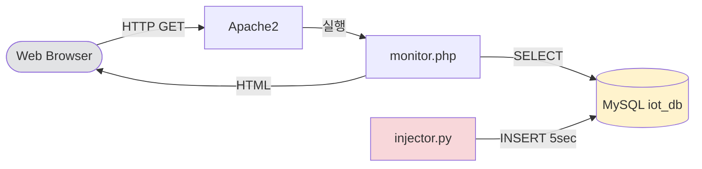
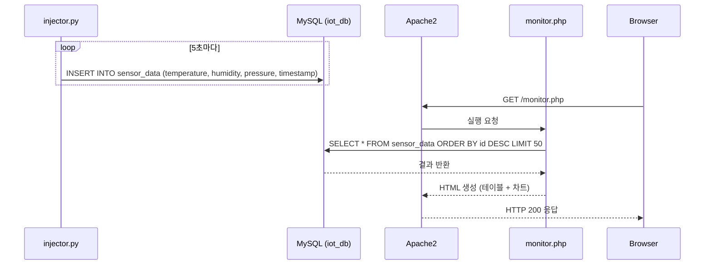

# Process Documentation — LAMP Real-Time Monitoring System

## 1. 시스템 개요

VMware 가상머신(Ubuntu 24.04) 위에 LAMP 스택을 구축하고,
Python 스크립트(`injector.py`)로 생성한 가상 센서 데이터를 MySQL에 저장하며,
PHP(`monitor.php`)를 통해 웹 브라우저에서 실시간으로 데이터를 확인하는 시스템이다.

---

## 2. 전체 시스템 블록도 (Mermaid)



---

## 3. 데이터 흐름 (Sequence Diagram)



---

## 4. DB 스키마

```sql
CREATE DATABASE iot_db;
USE iot_db;

CREATE TABLE sensor_data (
    id          INT AUTO_INCREMENT PRIMARY KEY,
    temperature FLOAT        NOT NULL,   -- °C  (-10 ~ 50)
    humidity    FLOAT        NOT NULL,   -- %   (20 ~ 90)
    pressure    FLOAT        NOT NULL,   -- hPa (950 ~ 1050)
    recorded_at DATETIME     NOT NULL DEFAULT CURRENT_TIMESTAMP
);
```

---

## 5. LAMP 설치 절차

```bash
# 1) 패키지 업데이트
sudo apt update && sudo apt upgrade -y

# 2) Apache2 설치
sudo apt install -y apache2

# 3) MySQL 설치 및 보안 설정
sudo apt install -y mysql-server
sudo mysql_secure_installation

# 4) PHP 및 MySQL 연동 모듈 설치
sudo apt install -y php libapache2-mod-php php-mysql

# 5) Apache 재시작
sudo systemctl restart apache2

# 6) Python MySQL 드라이버 설치
sudo apt install -y python3-pip
pip3 install mysql-connector-python faker
```

자동화 스크립트: `setup/lamp_setup.sh`

---

## 6. 실행 방법

### 6-1. DB 초기화

```bash
sudo mysql -u root -p < sql/init.sql
```

### 6-2. 데이터 주입

```bash
# 백그라운드 실행 (Ctrl+C로 종료)
python3 python/injector.py
```

### 6-3. 모니터링 페이지 배포

```bash
sudo cp php/monitor.php /var/www/html/monitor.php
```

브라우저에서 `http://<VM_IP>/monitor.php` 접속

---

## 7. GitHub 업로드 절차

```bash
git init
git add .
git commit -m "Week3: LAMP real-time monitoring system"
git remote add origin https://github.com/<YOUR_USERNAME>/<REPO_NAME>.git
git push -u origin main
```

---

## 8. 제출물 목록

| 항목 | 내용 |
|---|---|
| 동작 영상 | `submission.txt` 참조 |
| GitHub Repo | `submission.txt` 참조 |
| 소스코드 | `python/injector.py`, `php/monitor.php`, `sql/init.sql` |
| 설명 문서 | `process.md` (이 파일) |
